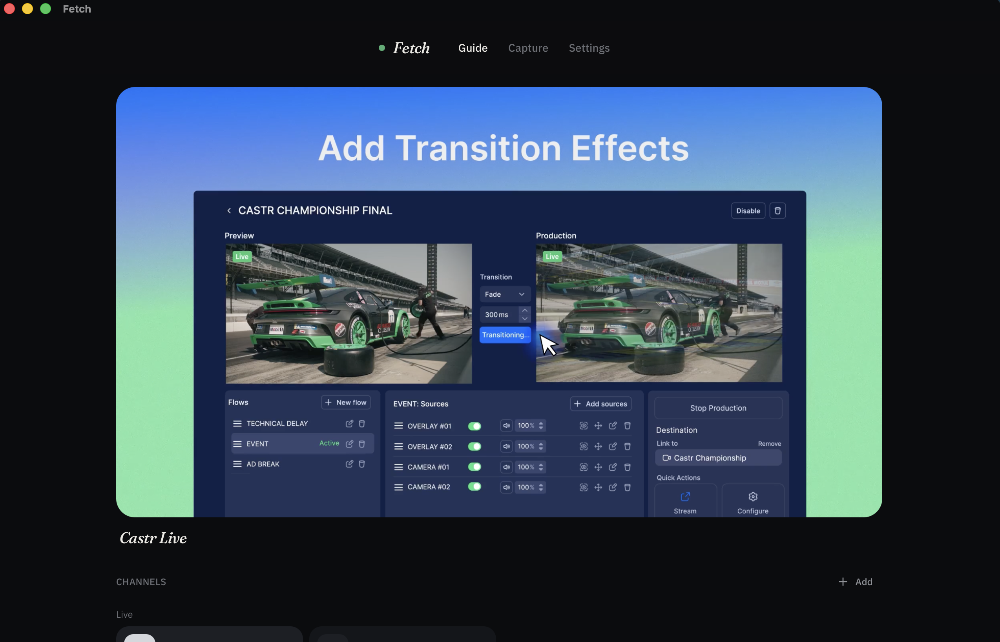

# Fetch

I built Fetch because I got tired of using my browser for streaming and having ads pop up left and right. Fetch is a macOS desktop app that simplifies this. It has a simple interface and video player. Provide a link with video content, and Fetch will retrieve and stream it for you. Say goodbye to those ads.

Download Fetch:

[Fetch.dmg](https://github.com/rexchao1/Fetch/releases/latest/download/Fetch_0.1.0_aarch64.dmg)

The first time you open Fetch, right-click it, then click Open, then click Open again.

## Background

Jellyfin is an open-source media server you run yourself. Movies, shows, and live channels, all on a machine you own. For live TV it wants an M3U file, a list of channel names and URLs. Each URL is usually an HLS (HTTP Live Stream) playlist. HLS is Apple's way of chopping video into tiny files and handing the player a text list of what to fetch next. That list is called a `.m3u8`. A master playlist would point at a few quality versions, while a media playlist points at the actual chunks. On a live feed those chunk names keep changing.

When streaming, browsers obtain these `.m3u8` URLs through their network requests. Every streaming browser gets it, and it is public information.

The fight is authorization. A lot of sites will only serve the video if the request looks like it came from their own player. They check the name of the recipient first, of course. Then they check the Referer, the supposed server that gave them the URL. They set a cookie after the page loads. Or, very commonly, they sign the playlist URL with a token, that may die in ten or fifteen minutes.

Jellyfin needs a public, solid URL. Paste these websites' URLs into Jellyfin and it may work once. When the token expires you get a 403, and Jellyfin has no way to go back to the page and get a new one. Fetch sits between them. Jellyfin only ever talks to Fetch, at a URL that does not rotate. Fetch talks to the origin with the headers and cookies a browser would send, and it rewrites the playlist so every chunk comes through Fetch too.

We do not have to impersonate any browser, and when a token is about to die, Fetch gets a fresh playlist before Jellyfin notices.

## Using Fetch

The Guide contains the channel lineup. Pick a channel and it plays. Add a playlist URL if you already have one.

More often, if you only have a website that plays in the browser, go to the Capture tab, paste the page URL, and sniff.
Sniff is the way Fetch finds the .m3u8. You give Fetch the website, it finds the player, watches the network tab, and takes the playlist plus any authorization that came with it.

Fetch is built to be in the background. Close the window and the path is gone. That is the point. Nothing remains to consume your CPU.
