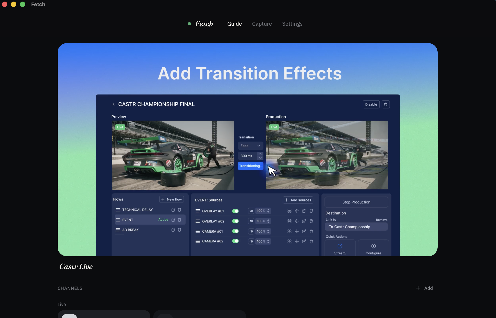

# Fetch

I built Fetch because I got tired of using my browser for streaming and seeing ads pop up left and right. Fetch is a macOS desktop app that makes this easier. It has a straightforward interface and a video player. Provide a video URL and Fetch will retrieve and stream it for you. Say goodbye to those ads.

[Download Fetch for macOS](https://github.com/rexchao1/Fetch/releases/latest/download/Fetch.dmg)

Fetch runs on Apple silicon Macs. When you first open Fetch, macOS may say it can't check it for malware. Open System Settings, go to Privacy & Security, and click Open Anyway.

## Background

Jellyfin is an open-source media server that you run yourself to manage movies, shows, and live channels on a machine you own. For live TV, Jellyfin uses an M3U file, which lists channel names and their URLs. Each URL is usually an HLS (HTTP Live Streaming) playlist. HLS is a streaming format that splits video into small files and gives the player a text list of what to fetch next. This list is called a `.m3u8`. A master playlist points to a few available quality levels, while a media playlist points to the actual chunks. On a live feed, those chunk names keep changing.

When streaming, browsers obtain these `.m3u8` URLs through network requests. Every browser playing a stream receives them, and they are publicly accessible.

The fight is authorization. A lot of sites will only serve the video if the request looks like it came from their own player. They check the recipient's name first, of course. Then they check the Referer, the page that supposedly gave them the URL. They set a cookie after the page loads. Or, very commonly, they sign the playlist URL with a token that may die in ten or fifteen minutes.

Jellyfin needs a public, stable URL. Paste these websites' URLs into Jellyfin and it may work once. After the token expires, you get a 403, and Jellyfin has no way to go back to the page and get a new one. Fetch sits between them. Jellyfin only ever talks to Fetch, at a URL that does not rotate. Fetch talks to the origin with the headers and cookies a browser would send, and it rewrites the playlist so every chunk comes through Fetch too.

Fetch does not have to impersonate a browser. When a token is about to die, Fetch gets a fresh playlist before Jellyfin notices.

## Using Fetch

The Guide shows the channel lineup. Select a channel to play it, or add a playlist URL if you already have one.

If you only have a website that plays in a browser, open the Capture tab, paste the page URL, and sniff.
Sniff is how Fetch finds the `.m3u8` playlist. It checks the website's network requests and captures the playlist and any authorization that came with it. It uses the copy of Google Chrome already installed on your Mac, in the background, so Chrome needs to be installed.

To connect Jellyfin, open Settings, copy the link, and add it in Jellyfin as an M3U tuner. The M3U list stays live, so channels you add later show up in Jellyfin on its next refresh, while Fetch is open. For now, Jellyfin has to run on the same Mac.

Fetch is designed to run in the background. Close the window and the path is gone. That is intentional. Nothing remains to consume your CPU.
